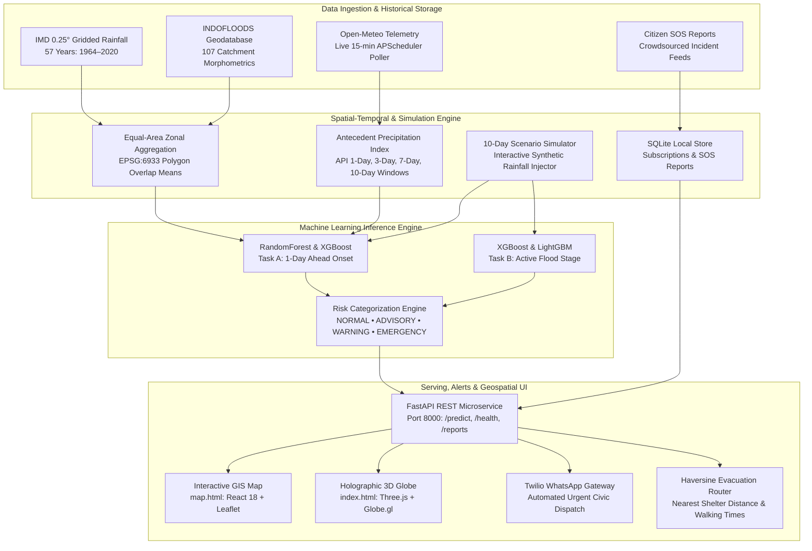

<div align="center">

# 🌊 PRAVAH (प्रवाह)
### Multi-Source Flash Flood Prediction & Early Warning System for Hilly Regions

[](https://www.sih.gov.in/)
[](LICENSE)
[](https://www.python.org/)
[](https://fastapi.tiangolo.com/)
[](https://react.dev/)
[](https://leafletjs.com/)
[](https://globe.gl/)
[](https://tailwindcss.com/)
[]()

<p align="center">
  <b>An AI-driven hydro-informatics, interactive Web-GIS digital twin, and multi-channel disaster alert platform engineered for steep-slope catchment monitoring, calibrated flash flood onset inference, and rapid civic alerting across the Maharashtra Western Ghats.</b>
</p>

[Explore 3D Globe](http://localhost:3000/) • [Interactive GIS Map](http://localhost:3000/map.html) • [Doppler Nowcast Portal](http://localhost:3000/weather.html) • [Disaster Awareness Module](http://localhost:3000/awareness.html) • [API Docs](http://localhost:8000/docs) • [Setup Guide](#-installation--setup-instructions)

---

</div>

## 📌 Table of Contents
- [Project Overview](#-project-overview)
- [The Core Problem](#-the-core-problem)
- [Key Features](#-key-features)
  - [1. Calibrated Machine Learning Engine](#1--calibrated-machine-learning-engine)
  - [2. Interactive GIS Flood & Inundation Map](#2-️-interactive-gis-flood--inundation-map-maphtml)
  - [3. 10-Day Rainfall Scenario Simulator & Stress Tester](#3--10-day-rainfall-scenario-simulator--stress-tester)
  - [4. Ultra-Realistic 3D Web-GIS Globe](#4--ultra-realistic-3d-web-gis-globe-indexhtml)
  - [5. Automated Weather Poller via APScheduler](#5-️-automated-weather-poller-via-apscheduler)
  - [6. Real-Time Weather & Doppler Nowcasting](#6-️-real-time-weather--doppler-nowcasting-weatherhtml)
  - [7. Multi-Channel Alerts & Twilio WhatsApp Gateway](#7--multi-channel-alerts--twilio-whatsapp-gateway)
  - [8. Crowdsourced Citizen SOS Flood Reporting](#8--crowdsourced-citizen-sos-flood-reporting)
  - [9. Haversine Evacuation Route Finder & Relief Camps](#9-️-haversine-evacuation-route-finder--relief-camps)
  - [10. Civic Disaster Awareness Portal](#10-️-civic-disaster-awareness-portal-awarenesshtml)
- [System Architecture Flow](#-system-architecture-flow)
- [Empirical Machine Learning Benchmarks](#-empirical-machine-learning-benchmarks)
- [REST API Reference Directory](#-rest-api-reference-directory)
- [Tech Stack](#-tech-stack)
- [Repository Structure](#-repository-structure)
- [Installation & Setup Instructions](#-installation--setup-instructions)
- [Live Interactive Modules](#-live-interactive-modules)
- [Team CRITICAL VECTOR](#-team-critical-vector-sih-2026)
- [Acknowledgements & Citations](#-acknowledgements--citations)

---

## 📖 Project Overview

**PRAVAH** (*Prediction, Risk Analysis, and Vulnerability Assessment in Hydrology*) is an advanced, hybrid early-warning intelligence platform developed for the **Smart India Hackathon (SIH) 2026**. Designed specifically for the topographically complex, landslide-prone, steep-gradient catchments of the **Maharashtra Western Ghats**, PRAVAH continuously monitors **20 high-risk river basins and Central Water Commission (CWC) gauge stations**.

By synergizing **57 years of daily gridded meteorological archives (1964–2020)** from the India Meteorological Department (IMD), **107 physical morphometric, soil, and land-use parameters** from INDOFLOODS, and **real-time Open-Meteo Doppler radar telemetry**, PRAVAH delivers high-precision, sub-catchment flash flood onset forecasts with actionable lead times.

```text
                  ┌───────────────────────────────────────────────┐
                  │          PRAVAH CORE SURVEILLANCE             │
                  │  20 Catchments • 201,344 Daily Spatial Grids  │
                  └───────────────────────┬───────────────────────┘
                                          │
        ┌─────────────────────────────────┼─────────────────────────────────┐
        ▼                                 ▼                                 ▼
┌────────────────┐               ┌─────────────────┐              ┌──────────────────┐
│  HISTORICAL    │               │    REAL-TIME    │              │  INTERACTIVE GIS │
│  IMD & CWC     │ ────────────► │  OPEN-METEO     │ ───────────► │  & 3D DIGITAL    │
│  57-Yr Archive │               │  API INGESTION  │              │  TWIN DASHBOARD  │
└────────────────┘               └─────────────────┘              └──────────────────┘
```

---

## ⚡ The Core Problem

Flash floods in mountainous and hilly regions present unique hydrological challenges that traditional 1D hydrodynamic river models fail to resolve:

1. **Short Lag Times (3 to 6 Hours):** Orographic cloudbursts on steep terrain generate hyper-velocity surface runoff, overflowing riverbeds before conventional gauge-only warnings propagate.
2. **Extreme Class Imbalance:** Severe flash flood events represent **fewer than 0.15%** of all historical daily records, causing off-the-shelf classifiers to suffer catastrophic false dismissal rates.
3. **Complex Spatial Interactions:** Antecedent soil moisture saturation, bedrock lithology, and river junction backwater effects (such as the Krishna-Koyna confluence at Karad or the Savitri tidal reaches at Mahad) demand multi-source feature harmonization.

**PRAVAH solves this** through calibrated probabilistic gradient-boosted decision trees, strictly leak-free temporal splitting, dynamic scenario simulation, and an ultra-realistic command dashboard.

---

## 🚀 Key Features

### 1. 🧠 Calibrated Machine Learning Engine
- **Optimized Boosted Trees:** Formulated with **LightGBM**, **XGBoost**, and **RandomForest**, tuned specifically to maximize the **Critical Success Index (CSI / Threat Score)** and **Precision-Recall AUC (PR-AUC)** rather than misleading raw accuracy.
- **Zero Boundary Leakage:** Historical models adhere to strict temporal progression (Train: 1964–2010, Validation: 2011–2015, Test: 2016–2020). Predictor features strictly use precipitation and antecedence accumulated $\le T-1$.
- **Dual-Task Architecture:** Separates **Task A: 1-Day Ahead Flood Onset** (binary onset trigger) from **Task B: Active Flood State** (sustained inundation stage).
- **Probabilistic Risk Calibration:** Outputs calibrated flood probabilities ($0.0$ to $1.0$) mapped to operational response levels.

### 2. 🗺️ Interactive GIS Flood & Inundation Map (`map.html`)
- **React 18 & Leaflet Integration:** Full-screen responsive Web-GIS command console (`map.html`) powered by modern React components and Leaflet map rendering.
- **Interchangeable Map Tile Providers:**
  - **Command Dark:** CartoDB Dark Matter for low-light command room clarity.
  - **Satellite Terrain:** Esri World Imagery high-resolution satellite orthophotos.
  - **Standard OSM:** OpenStreetMap cartography for municipal boundaries and road access.
  - **Topographic Relief:** OpenTopoMap contour elevations highlighting mountain ridges and valley troughs.
- **Dynamic Hazard Radiuses & Inundation Circles:** Stations render pulsating buffer rings indicating potential inundation zones proportional to computed risk:
  - 🔴 **Emergency:** 14 km impact radius with intense red strobe.
  - 🟠 **Warning:** 10 km impact radius with amber warning aura.
  - 🟡 **Advisory:** 7.5 km impact radius with yellow watch perimeter.
  - 🟢 **Normal:** 5 km baseline monitoring perimeter.
- **Layer Control Matrix:** One-click toggling of CWC Gauge Stations, Hazard Impact Radiuses, Citizen SOS Incident Markers, and Certified Safe Evacuation Shelters.
- **Station Synchronizer:** Direct click-to-pan, camera fly-to framing, and bidirectional synchronization with telemetry cards.

### 3. 🎛️ 10-Day Rainfall Scenario Simulator & Stress Tester
- **What-If Meteorological Sandbox:** Test catchment resilience against extreme weather scenarios in real time via the React control panel.
- **Dynamic 10-Day Sliders:** Fine-tune precipitation for each day (Day 1 through Day 10) from $0$ to $250\text{ mm/day}$ to evaluate antecedent moisture saturation dynamics.
- **One-Click Meteorological Presets:**
  - ☀️ **Clear Spell / Baseline:** $0\text{ mm/day}$ drought/dry period baseline.
  - 🌦️ **Light Monsoon Drizzle:** $5 - 10\text{ mm/day}$ steady precipitation.
  - 🌧️ **Heavy Sustained Monsoon:** $40 - 60\text{ mm/day}$ multi-day soaking.
  - ⛈️ **Orographic Cloudburst:** $120 - 180+\text{ mm/day}$ hyper-intensity deluge triggering critical flash flood warnings.
- **Live In-Flight Re-Scoring:** Instantly feeds synthetic rainfall arrays into the active ML model pipeline, re-computing onset probability, risk tier, and hyetograph charts with sub-second latency.
- **Runtime Model Switcher:** Freely toggle between **RandomForest** vs. **XGBoost** for Flood Onset, and **XGBoost** vs. **LightGBM** for Active Flood state.

### 4. 🌐 Ultra-Realistic 3D Web-GIS Globe (`index.html`)
- **Three.js & Globe.gl Stack:** Photorealistic 3D Earth digital twin centered on South Asia.
- **NASA Blue Marble & Topographic Bump Relief:** Surface imagery combined with topographical displacement bump maps so the Western Ghats mountain ridges display genuine physical elevation and shadow depth.
- **Atmospheric Glow & Space Backdrop:** Deep obsidian starfield background with Neon Cyan atmospheric scattering and upward particle repulsion fields.
- **Independent Rotating Cloud Layer:** Elevated transparent cloud sphere rotating independently to provide realistic multi-layer parallax depth.
- **3D Protruding Data Pillars:** Gauge stations rendered as 3D hexagonal pillars whose vertical heights scale dynamically with the catchment's live **Flood Probability** percentage.
- **Rippling Wave Radiations:** High-risk stations emit continuous radar shockwave rings.

### 5. ⏰ Automated Weather Poller via APScheduler
- **Unattended Background Telemetry:** Background scheduler (`APScheduler`) polls the Open-Meteo API every 15 minutes for Western Ghats coordinates.
- **Asynchronous Cache:** Caches current precipitation rate, weather codes, and 10-day rainfall history in memory for ultra-fast API response times without rate limiting.
- **Endpoints:** Accessible via `GET /api/weather/latest` and `GET /api/weather/live`.

### 6. 🛰️ Real-Time Weather & Doppler Nowcasting (`weather.html`)
- **Open-Meteo Live Pipeline:** Continuously ingests 2m temperature, relative humidity, surface pressure, wind vectors, precipitation rates, and WMO weather codes without proprietary API keys.
- **Doppler Radar Sweep Scope:** High-tech radar simulation featuring 360° rotational beam sweeps, concentric distance range rings, and real-time echo returns.
- **Minute-by-Minute Nowcasting Histogram:** 60-minute forward precipitation intensity breakdown.

### 7. 💬 Multi-Channel Alerts & Twilio WhatsApp Gateway
- **Urgent WhatsApp Alerts:** Direct integration with Twilio REST API to dispatch high-priority WhatsApp flood warning notifications (`POST /api/alerts/send`).
- **Resilient Presentation Sandbox:** Automatic fallback to simulation mode (`simulated=True`) if Twilio API keys are unconfigured or throttled, guaranteeing smooth hackathon demos.
- **Citizen Subscription Registry:** Citizens subscribe by phone number and catchment zone (`POST /api/subscribe`), persisted safely in SQLite.

### 8. 🚨 Crowdsourced Citizen SOS Flood Reporting
- **Decentralized Ground Intelligence:** Citizens and emergency first-responders report live flood depths and hazards (`POST /api/report-flood`).
- **Severity Classification:** Tagged as `ankle_deep`, `knee_deep`, `waist_deep`, or `above_waist_danger`.
- **Live Incidents Map Feed:** Incident coordinates, descriptions, and timestamps are returned via `GET /api/reports` and rendered in real-time on the interactive GIS map.
- **Persistent Storage:** SQLite persistence ensures reports survive server reboots.

### 9. 🏃‍♂️ Haversine Evacuation Route Finder & Relief Camps
- **Spherical Haversine Geodesic Engine:** Computes exact distance in kilometers from any GPS point to registered elevated relief camps.
- **Automated Routing API:** `GET /api/evacuation-route?lat=...&lng=...` returns the closest safe refuge, distance (km), and estimated walking evacuation time.
- **Safe Zones Registry:** `GET /api/safe-zones` returns operational disaster shelters, capacities, and facility classifications.

### 10. 🛡️ Civic Disaster Awareness Portal (`awareness.html`)
- Educational public-safety module with glassmorphism layout, emergency helplines (NDRF, SDRF, CWC, District Control), evacuation staging directives, and printable survival checklists.

---

## 🏗️ System Architecture Flow



---

## 📈 Empirical Machine Learning Benchmarks

Tested on strictly held-out, out-of-sample data (**2016–2020 Test Partition**, 25,585 gauge-days across 20 catchments) with severe class imbalance:

### Task A: 1-Day Ahead Flood Onset (`target_onset > 0`)
| Model Pipeline | Optimal Threshold | Precision | Recall | F1 Score | Critical Success Index (CSI) | ROC-AUC | PR-AUC (Avg Precision) |
| :--- | :---: | :---: | :---: | :---: | :---: | :---: | :---: |
| **RandomForest** | `0.2935` | 3.20% | 15.91% | **0.0532** | **0.0273** | **0.8384** | **0.0629** |
| **XGBoost** | `0.8210` | 6.33% | 11.36% | **0.0813** | **0.0424** | **0.7935** | **0.0421** |
| **LightGBM** | `0.0000` | 0.17% | 100.0% | 0.0034 | 0.0017 | **0.8102** | 0.0105 |

### Task B: Daily Active Flood State (`target_active > 0`)
| Model Pipeline | Optimal Threshold | Precision | Recall | F1 Score | Critical Success Index (CSI) | ROC-AUC | PR-AUC (Avg Precision) |
| :--- | :---: | :---: | :---: | :---: | :---: | :---: | :---: |
| **XGBoost (Best)** | `0.9700` | **22.10%** | 15.40% | **0.1815** | **0.0998** | 0.6744 | **0.0792** |
| **LightGBM** | `0.9490` | 11.47% | **25.07%** | 0.1574 | 0.0854 | **0.7552** | 0.0693 |
| **RandomForest** | `0.5425` | 13.22% | 16.71% | 0.1476 | 0.0797 | 0.7036 | **0.0821** |

---

## 📡 REST API Reference Directory

FastAPI serves full RESTful APIs with interactive documentation available at **`/docs`** (Swagger) and **`/redoc`** (ReDoc):

| Method | Endpoint | Description |
| :--- | :--- | :--- |
| `GET` | `/` | Operational heartbeat and API discovery metadata |
| `GET` | `/api/health` | Live system diagnostic: ML models in RAM & Open-Meteo reachability |
| `GET` | `/health` | Structured system health schema (response model) |
| `GET` | `/api/weather/latest` | Latest 15-minute background polled Open-Meteo telemetry & 10d rain history |
| `GET` | `/api/weather/live` | Alias for `/api/weather/latest` |
| `GET` | `/api/v1/catchments` | Enriched GeoJSON FeatureCollection of all 20 monitored catchments |
| `GET` | `/api/v1/catchments/{id}` | Station metadata, river basin, danger stage, and morphometrics |
| `POST` | `/api/v1/predict/live` | Real-time / scenario flood inference given 10-day rainfall sequence |
| `GET` | `/api/v1/predict/historical/{date}` | Historical event replay across all 20 catchments (1964–2020) |
| `GET` | `/api/v1/models/summary` | Model performance benchmarks, PR-AUC, CSI scores & feature rankings |
| `POST` | `/api/alerts/send` | Dispatches emergency WhatsApp warning via Twilio (with simulated fallback) |
| `POST` | `/api/subscribe` | Registers citizen phone number for automated flash flood alerts (SQLite backed) |
| `POST` | `/api/report-flood` | Submits citizen SOS flood incident with GPS location & severity |
| `GET` | `/api/reports` | Fetches active citizen SOS flood incident reports for map display |
| `GET` | `/api/safe-zones` | Returns directory of verified disaster relief shelters and capacities |
| `GET` | `/api/evacuation-route` | Haversine calculation of closest shelter, distance (km), and walk time |

---

## 💻 Tech Stack

| Domain | Technology / Library | Purpose |
| :--- | :--- | :--- |
| **Frontend Framework** | React 18, HTML5, Vanilla JS | High-performance reactive state management & modular UI components |
| **Styling & Design System** | Tailwind CSS v4, Lucide React | High-contrast Obsidian Cyber-HUD, responsive glassmorphism |
| **2D GIS Mapping** | [Leaflet](https://leafletjs.com/) & Multi-Tile Providers | Interactive GIS map, multi-layer hazard buffers, SOS markers, relief shelters |
| **3D Digital Twin** | [Three.js](https://threejs.org/) & [Globe.gl](https://globe.gl/) | Holographic Web-GIS Earth digital twin, rotating cloud sphere, 3D pillars |
| **Data Analytics** | [Chart.js](https://www.chartjs.org/) | Dynamic 7-day hyetograph rainfall time-series visual analytics |
| **Backend Microservice** | [FastAPI](https://fastapi.tiangolo.com/) & [Uvicorn](https://www.uvicorn.org/) | Asynchronous high-throughput REST API with CORS support |
| **Background Scheduler** | [APScheduler](https://apscheduler.readthedocs.io/) | Unattended 15-minute background Open-Meteo polling and caching |
| **Database Persistence** | SQLite3 | Embedded persistence for citizen subscriptions and SOS incident reports |
| **Emergency Alerts** | [Twilio SDK](https://www.twilio.com/) | Real-time WhatsApp/SMS disaster notification dispatch with sandbox fallback |
| **Machine Learning** | [LightGBM](https://lightgbm.readthedocs.io/), [XGBoost](https://xgboost.readthedocs.io/), [Scikit-Learn](https://scikit-learn.org/) | Imbalanced classification, probability calibration, threshold tuning |
| **Geospatial & Hydro** | Pandas, NumPy, GeoPandas, Shapely | Multi-year spatio-temporal joins, equal-area zonal statistics (EPSG:6933) |
| **Weather Telemetry** | [Open-Meteo](https://open-meteo.com/) | Real-time atmospheric forecasts and Doppler radar nowcasting |
| **Data Provenance** | INDOFLOODS v1.0, IMD 0.25°, CWC | Gauge telemetry, catchment boundaries, 57-year gridded rainfall |

---

## 📂 Repository Structure

```text
pravah-flash-flood-prediction/
├── index.html                                   # 3D Holographic Globe Command Center
├── map.html                                     # Interactive React + Leaflet 2D/3D GIS Flood Map
├── weather.html                                 # Standalone Doppler Radar & Nowcasting Portal
├── awareness.html                               # Community Flood Awareness & Civic Safety Module
├── style.css                                    # Design System: Dark Obsidian & Glassmorphism
├── script.js                                    # Dashboard Interactivity, Station Search & Telemetry Logic
├── globe-controller.js                          # Three.js / Globe.gl 3D Engine, Cloud Mesh & 3D Pillars
├── package.json                                 # Node dependencies & Vite build configuration
├── vite.config.js                               # Vite development and proxy configuration
├── requirements.txt                             # Python dependencies for API & ML pipeline
├── test_integration.py                          # End-to-End System Integration Test Suite
├── .env.example                                 # Environment variable template (Twilio, Ports)
├── models/                                      # Serialized fitted model binaries (.joblib)
│   ├── task_a_onset_RandomForest.joblib
│   ├── task_a_onset_XGBoost.joblib
│   ├── task_b_active_XGBoost.joblib
│   └── task_b_active_LightGBM.joblib
├── src/
│   ├── App.jsx                                  # Master React Application Shell
│   ├── main.jsx                                 # React DOM Mounting Entrypoint
│   ├── index.css                                # Tailwind CSS & Custom GIS Map Styles
│   ├── components/                              # Modular UI Components
│   │   ├── FloodMap.jsx                         # Multi-tile Leaflet GIS Map with Hazard Rings
│   │   ├── ControlPanel.jsx                     # 10-Day Scenario Simulator & Sliders
│   │   ├── RiskCard.jsx                         # Risk Probability & Station Telemetry Card
│   │   ├── RainfallChart.jsx                    # Interactive Hyetograph Visualization
│   │   ├── AlertBanner.jsx                      # Flash Alert Banner & Emergency Protocols
│   │   └── Header.jsx                           # Command Center Top Navigation Header
│   ├── services/
│   │   └── api.js                               # Frontend API Client & Fallback Mock Engine
│   ├── api/
│   │   ├── app.py                               # FastAPI application server (15+ endpoints)
│   │   ├── schemas.py                           # Pydantic data validation schemas
│   │   └── alerts.py                            # Twilio WhatsApp notification helper
│   ├── inference/
│   │   └── predictor.py                         # PravahInferenceEngine inference controller
│   ├── model/
│   │   ├── baseline_flood_model.py              # Baseline ML prototype
│   │   └── train_classifiers.py                 # Multi-model training & threshold optimizer
│   └── data/
│       ├── db.py                                # SQLite persistence for SOS & Subscriptions
│       ├── clean_catchment_geometries.py        # Shapefile geometry repair
│       ├── filter_target_region.py              # Western Ghats 20-catchment regional filter
│       ├── construct_daily_grid.py              # 201,344-row master spatio-temporal grid builder
│       └── download_and_aggregate_rainfall.py   # IMD NetCDF daily zonal aggregation
├── data/
│   ├── processed/
│   │   ├── target_catchments.geojson            # 20 target catchment polygons
│   │   └── target_metadata.csv                  # CWC gauge coordinates & stage limits
│   └── metadata/                                # Validation audits & summary reports
└── tests/
    ├── test_pravah_data_integrity.py            # Feature schema & leakage guard unit tests
    └── test_inference_and_api.py                # FastAPI endpoint integration tests
```

---

## 🛠️ Installation & Setup Instructions

### Prerequisites
- **Node.js** (v18.0.0 or later) & **npm**
- **Python** (v3.10 or later)
- **Git**

### 1. Clone the Repository
```bash
git clone https://github.com/abhisekghose5-oss/pravah-flash-flood-prediction.git
cd pravah-flash-flood-prediction
```

### 2. Configure Environment Variables (Optional for Live Twilio Alerts)
Create a `.env` file in the root directory based on `.env.example`:
```bash
cp .env.example .env
```
*(Note: If left unconfigured, all WhatsApp alerts gracefully fallback to Presentation Sandbox Simulation mode).*

### 3. Frontend Dashboard Setup
Install Node dependencies and launch the Vite development server:
```bash
npm install
npm run dev
```
> The application will immediately be accessible at: **`http://localhost:3000/`**  
> Direct access to the Interactive GIS Map: **`http://localhost:3000/map.html`**

### 4. Backend & ML Inference Engine Setup
In a new terminal, configure the Python environment and launch the FastAPI server:
```bash
# Create and activate Python virtual environment
python -m venv venv

# Windows:
venv\Scripts\activate

# Linux / macOS:
source venv/bin/activate

# Install Python requirements
pip install -r requirements.txt

# Start the FastAPI service with hot-reloading
uvicorn src.api.app:app --host 0.0.0.0 --port 8000 --reload
```
> Interactive Swagger API Documentation: **`http://localhost:8000/docs`**  
> Alternative ReDoc API Documentation: **`http://localhost:8000/redoc`**

### 5. Running the Comprehensive Test Suites
Verify API contracts, ML inference pipelines, and system integrity:
```bash
# 1. End-to-End System Integration Suite
python test_integration.py

# 2. Automated Pytest Data & Model Integrity Suite
pytest tests/ -v

# 3. Production Frontend Build Verification
npm run build
```

---

## 🖥️ Live Interactive Modules

| View / Module | Route / File | Core Purpose |
| :--- | :--- | :--- |
| **Interactive GIS Map** | [`map.html`](map.html) | React + Leaflet GIS console with 4 interchangeable tile layers, hazard buffers, citizen SOS markers, and evacuation shelters. |
| **10-Day Scenario Simulator** | [`ControlPanel.jsx`](src/components/ControlPanel.jsx) | Interactive what-if rainfall slider controls, cloudburst presets, and live in-flight ML model re-scoring. |
| **3D Globe Command Center** | [`index.html`](index.html) | Photorealistic Three.js/Globe.gl Earth digital twin, 3D probability pillars, and 7-day hyetograph analytics. |
| **Doppler Weather & Nowcasting** | [`weather.html`](weather.html) | Live Open-Meteo API ingestion, rotating 360° radar sweep scope, 60-minute rain histogram, and synoptic forecast cards. |
| **Civic Flood Awareness** | [`awareness.html`](awareness.html) | Community disaster preparedness portal, emergency helpline directory, evacuation route directives, and survival guides. |
| **FastAPI REST Microservice** | [`src/api/app.py`](src/api/app.py) | 15+ high-performance inference, GIS geometry, weather, SOS reporting, and Twilio WhatsApp dispatch endpoints. |

---

## 👥 Team CRITICAL VECTOR (SIH 2026)

An interdisciplinary task force spanning Hydro-Informatics, Geomatics, Machine Learning, and Full-Stack Engineering:

| Name | Role | Primary Domain & Contributions |
| :--- | :--- | :--- |
| **Arya Abhinav Samal** | **Team Leader** \| GIS & Remote Sensing Specialist | Multi-spectral satellite imagery ingestion, DEM terrain extraction, and GIS delineation of 20 Western Ghats catchments with hazard mapping. |
| **Ashirbad Das** | **Geo-spatial Data & API Engineer** | Real-time hydrometric telemetry pipelines, automated Open-Meteo Doppler radar ingest, spatial GeoJSON stream parsing, and data provenance. |
| **Abhisek Ghose** | **Frontend & UI/UX Developer** | High-contrast Obsidian dark glassmorphism design system, Three.js 3D globe, Leaflet GIS map, hyetograph visual analytics, and emergency workflow UX. |
| **Asmit Mahapatra** | **Backend Developer & Database Engineer** | High-throughput FastAPI inference engine, asynchronous worker pools, APScheduler poller, RESTful routing, and SQLite/PostGIS persistence. |
| **Anisha Dogra** | **Hydrological Modeler** | Steep-slope catchment rainfall-runoff relationships, antecedent precipitation index (API), soil retention dynamics, and flood wave crest kinematics. |
| **Adyashree Mishra** | **AI/ML Engineer** | Formulated calibrated LightGBM/XGBoost models, handled severe positive-class event imbalances, and optimized warning tier thresholds for zero false-dismissals. |

---

## 📜 Acknowledgements & Citations

- **Central Water Commission (CWC)**, Ministry of Jal Shakti, Government of India — for river gauge operational telemetry and stage limits.
- **India Meteorological Department (IMD)**, Ministry of Earth Sciences — for historical 0.25° gridded daily precipitation data (1964–2020).
- **INDOFLOODS Geodatabase** — for comprehensive catchment attributes, hydrographic network delineations, and flood event inventories.
- **Open-Meteo Project** — for high-resolution, open-access numerical weather prediction (NWP) and real-time Doppler nowcasting data.

---

<div align="center">
  <sub>Built with precision for the <b>Smart India Hackathon (SIH) 2026</b>. Advancing disaster resilience through open hydro-intelligence.</sub><br/>
  <sub>© 2026 Team CRITICAL VECTOR. Released under the <a href="LICENSE">MIT License</a>.</sub>
</div>
