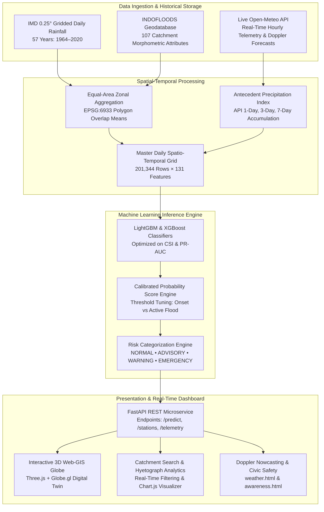

<div align="center">

# 🌊 PRAVAH (प्रवाह)
### Multi-Source Flash Flood Prediction & Early Warning System for Hilly Regions

[](https://www.sih.gov.in/)
[](LICENSE)
[](https://www.python.org/)
[](https://fastapi.tiangolo.com/)
[](https://globe.gl/)
[]()

<p align="center">
  <b>An AI-driven hydro-informatics and 3D Web-GIS digital twin engineered for steep-slope catchment monitoring, calibrated flash flood onset inference, and rapid civic disaster alerting across the Maharashtra Western Ghats.</b>
</p>

[Explore Live Demo](http://localhost:3000/) • [Doppler Nowcast Portal](http://localhost:3000/weather.html) • [Disaster Awareness Module](http://localhost:3000/awareness.html) • [System Architecture](#-system-architecture) • [Setup Guide](#-installation--setup-instructions)

---

</div>

## 📌 Table of Contents
- [Project Overview](#-project-overview)
- [The Core Problem](#-the-core-problem)
- [Key Features](#-key-features)
- [System Architecture Flow](#-system-architecture-flow)
- [Empirical Machine Learning Benchmarks](#-empirical-machine-learning-benchmarks)
- [Tech Stack](#-tech-stack)
- [Repository Structure](#-repository-structure)
- [Installation & Setup Instructions](#-installation--setup-instructions)
- [Live Interactive Modules](#-live-interactive-modules)
- [Team PRAVAH](#-team-pravah-sih-2026)
- [Acknowledgements & Citations](#-acknowledgements--citations)

---

## 📖 Project Overview

**PRAVAH** (*Prediction, Risk Analysis, and Vulnerability Assessment in Hydrology*) is an advanced, hybrid early-warning intelligence platform developed for **Smart India Hackathon (SIH) 2026**. Designed specifically for the topographically complex, landslide-prone, steep-gradient catchments of the **Maharashtra Western Ghats**, PRAVAH continuously monitors **20 high-risk river basins and Central Water Commission (CWC) gauge stations**.

By synergizing **57 years of daily gridded meteorological archives (1964–2020)** from the India Meteorological Department (IMD), **107 physical morphometric, soil, and land-use parameters** from INDOFLOODS, and **real-time Open-Meteo Doppler radar telemetry**, PRAVAH delivers high-precision, sub-catchment flash flood onset forecasts with actionable lead times.

```
                  ┌───────────────────────────────────────────────┐
                  │          PRAVAH CORE SURVEILLANCE             │
                  │  20 Catchments • 201,344 Daily Spatial Grids  │
                  └───────────────────────┬───────────────────────┘
                                          │
        ┌─────────────────────────────────┼─────────────────────────────────┐
        ▼                                 ▼                                 ▼
┌────────────────┐               ┌─────────────────┐              ┌──────────────────┐
│  HISTORICAL    │               │    REAL-TIME    │              │  HOLOGRAPHIC 3D  │
│  IMD & CWC     │ ────────────► │  OPEN-METEO     │ ───────────► │  WEB-GIS GLOBE   │
│  57-Yr Archive │               │  API INGESTION  │              │  & CIVIC ALERTS  │
└────────────────┘               └─────────────────┘              └──────────────────┘
```

---

## ⚡ The Core Problem

Flash floods in mountainous and hilly regions present unique hydrological challenges that traditional 1D hydrodynamic river models fail to resolve:

1. **Short Lag Times (3 to 6 Hours):** Orographic cloudbursts on steep terrain generate hyper-velocity surface runoff, overflowing riverbeds before conventional gauge-only warnings propagate.
2. **Extreme Class Imbalance:** Severe flash flood events represent **fewer than 0.15%** of all historical daily records, causing off-the-shelf classifiers to suffer catastrophic false dismissal rates.
3. **Complex Spatial Interactions:** Antecedent soil moisture saturation, bedrock lithology, and river junction backwater effects (such as the Krishna-Koyna confluence at Karad or the Savitri tidal reaches at Mahad) demand multi-source feature harmonization.

**PRAVAH solves this** through calibrated probabilistic gradient-boosted decision trees, strictly leak-free temporal splitting, and an ultra-realistic 3D command center.

---

## 🚀 Key Features

### 1. 🧠 Calibrated Machine Learning Engine
- **Optimized Boosted Trees:** Formulated with **LightGBM** and **XGBoost**, tuned specifically to maximize the **Critical Success Index (CSI / Threat Score)** and **Precision-Recall AUC (PR-AUC)** rather than misleading raw accuracy.
- **Zero Boundary Leakage:** Historical models adhere to strict temporal progression (Train: 1964–2010, Validation: 2011–2015, Test: 2016–2020). Predictor features strictly use precipitation and antecedence accumulated $\le T-1$.
- **Probabilistic Risk Calibration:** Outputs calibrated flood probabilities ($0.0$ to $1.0$) rather than blunt binary decisions.

### 2. 🛰️ Real-Time Weather & Doppler Nowcasting (`weather.html`)
- **Open-Meteo Live API Pipeline:** Continuously ingests 2m temperature, relative humidity, surface pressure, wind vectors, precipitation rates, and WMO weather codes across Western Ghats catchments without requiring proprietary API keys.
- **Doppler Radar Sweep Scope:** High-tech CSS radar simulation featuring 360° rotational beam sweeps, concentric distance range rings, and real-time echo returns.
- **Minute-by-Minute Nowcasting Histogram:** 60-minute forward precipitation intensity breakdown.

### 3. 🌐 Ultra-Realistic 3D Web-GIS Globe
- **Next-Gen Three.js & Globe.gl Stack:** Replaces standard flat maps with a photorealistic 3D Earth digital twin.
- **NASA Blue Marble & Topographic Bump Relief:** High-resolution satellite surface imagery combined with topographical displacement bump maps so the Western Ghats mountain ridges display genuine physical elevation and shadow depth.
- **Atmospheric Glow & Space Backdrop:** Deep obsidian starfield background with Neon Cyan (`#06b6d4`) fresnel atmospheric scattering.
- **Independent Rotating Cloud Layer:** Elevated transparent cloud sphere rotating independently to provide realistic multi-layer parallax depth.
- **3D Protruding Data Pillars:** Gauge stations rendered as 3D hexagonal pillars whose vertical heights scale dynamically with the catchment's live **Flood Probability** percentage.
- **Rippling Wave Radiations:** Emergency stations emit continuous radar shockwave rings.

### 4. 📊 Workable Catchment Telemetry Sidebar
- **Real-Time Substring Search & Filtering:** Filter across all 20 stations instantaneously by station name, CWC station code, river basin, or administrative district.
- **Live Counter & One-Click Clear:** Dynamic counter badge (`X / 20 STATIONS`) with instantaneous search reset.
- **Bidirectional 3D Globe Synchronization:** Clicking any sidebar card commands the 3D globe camera to smoothly fly to that station's exact coordinates (`[lat, lng]`), updates the circular SVG gauge, counts up the probability, shifts the risk badge, and recalculates the **7-Day Hyetograph Chart**. Clicking a 3D pillar on the globe reciprocal-scrolls and highlights the corresponding sidebar card.

### 5. 🚨 4-Tier Dynamic Risk Protocol
- 🟢 **NORMAL (< 25% Probability):** Streamflow stable within natural carrying capacity.
- 🟡 **ADVISORY (25% – 50% Probability):** Soil profile saturated; culvert backflow monitoring initiated.
- 🟠 **WARNING (50% – 75% Probability):** Channel surcharging; stage inundation watch active for low bridges.
- 🔴 **EMERGENCY (> 75% Probability):** Immediate bank overtopping predicted; sirens dispatched to SDRF & NDRF teams.

### 6. 🛡️ Civic Disaster Awareness Portal (`awareness.html`)
- Educational public-safety module with glassmorphism layout, parallax header, verified emergency helplines, evacuation staging routes, and printable flood survival checklists.

---

## 🏗️ System Architecture Flow



---

## 📈 Empirical Machine Learning Benchmarks

Tested on strictly held-out, out-of-sample data (**2016–2020 Test Partition**, 25,585 gauge-days across 20 catchments) with severe class imbalance:

### Task A: 1-Day Ahead Flood Onset (`target_onset > 0`)
| Model Pipeline | Optimal Threshold | Precision | Recall | F1 Score | Critical Success Index (CSI) | ROC-AUC | PR-AUC (Avg Precision) |
| :--- | :---: | :---: | :---: | :---: | :---: | :---: | :---: |
| **RandomForest** | `0.2935` | 3.20% | 15.91% | **0.0532** | **0.0273** | **0.8384** | **0.0629** |
| **XGBoost** | `0.8210` | 6.33% | 11.36% | **0.0813** | **0.0424** | **0.7935** | **0.0421** |
| **LightGBM** | `0.0000` | 0.17% | 100.0% | 0.0034 | 0.0017 | **0.8102** | 0.0105 |

### Task B: Daily Active Flood State (`target_active > 0`)
| Model Pipeline | Optimal Threshold | Precision | Recall | F1 Score | Critical Success Index (CSI) | ROC-AUC | PR-AUC (Avg Precision) |
| :--- | :---: | :---: | :---: | :---: | :---: | :---: | :---: |
| **XGBoost (Best)** | `0.9700` | **22.10%** | 15.40% | **0.1815** | **0.0998** | 0.6744 | **0.0792** |
| **LightGBM** | `0.9490` | 11.47% | **25.07%** | 0.1574 | 0.0854 | **0.7552** | 0.0693 |
| **RandomForest** | `0.5425` | 13.22% | 16.71% | 0.1476 | 0.0797 | 0.7036 | **0.0821** |

---

## 💻 Tech Stack

| Domain | Technology / Library | Purpose |
| :--- | :--- | :--- |
| **Frontend Architecture** | HTML5, Advanced CSS3, Vanilla JS, React 18 | High-contrast dark Obsidian glassmorphism user interface |
| **3D Visualization** | [Three.js](https://threejs.org/) & [Globe.gl](https://globe.gl/) | Holographic Web-GIS Earth digital twin, rotating cloud layers, 3D pillars |
| **Data Visualization** | [Chart.js](https://www.chartjs.org/) | Dynamic 7-day hyetograph rainfall time-series analytics |
| **Backend Framework** | [FastAPI](https://fastapi.tiangolo.com/) & [Uvicorn](https://www.uvicorn.org/) | High-throughput asynchronous RESTful inference endpoints |
| **Data Validation** | [Pydantic v2](https://docs.pydantic.dev/) | Strict telemetry request/response schema enforcement |
| **Machine Learning** | [LightGBM](https://lightgbm.readthedocs.io/), [XGBoost](https://xgboost.readthedocs.io/), [Scikit-Learn](https://scikit-learn.org/) | Imbalanced classification, probability calibration, threshold tuning |
| **Data Science & GIS** | Pandas, NumPy, GeoPandas, Shapely | Multi-year spatio-temporal joins, equal-area zonal statistics (EPSG:6933) |
| **Telemetry APIs** | [Open-Meteo](https://open-meteo.com/) | Real-time atmospheric forecasts and Doppler radar nowcasting |
| **Data Sources** | INDOFLOODS v1.0, India Flood Inventory (IFI), IMD 0.25° | CWC hydrometric records, catchment boundaries, daily rainfall grids |

---

## 📂 Repository Structure

```text
pravah-flash-flood-prediction/
├── index.html                                   # Main Dashboard (3D Globe, Prediction Panel, Telemetry)
├── weather.html                                 # Standalone Doppler Radar & Nowcasting Portal
├── awareness.html                               # Community Flood Awareness & Civic Safety Module
├── style.css                                    # Design System: Dark Obsidian, Glassmorphism & Cyber HUD
├── script.js                                    # Dashboard Interactivity, Station Search & Telemetry Logic
├── globe-controller.js                          # Three.js / Globe.gl 3D Engine, Cloud Mesh & 3D Pillars
├── package.json                                 # Node dependencies & Vite build configuration
├── vite.config.js                               # Vite local development server config
├── requirements.txt                             # Python dependencies for API & ML pipeline
├── models/                                      # Serialized fitted model binaries (.joblib)
│   ├── task_a_onset_RandomForest.joblib
│   ├── task_a_onset_XGBoost.joblib
│   ├── task_b_active_XGBoost.joblib
│   └── task_b_active_LightGBM.joblib
├── src/
│   ├── api/
│   │   ├── app.py                               # FastAPI application server
│   │   └── schemas.py                           # Pydantic data validation schemas
│   ├── inference/
│   │   └── predictor.py                         # PravahInferenceEngine inference controller
│   ├── model/
│   │   ├── baseline_flood_model.py              # Baseline ML prototype
│   │   └── train_classifiers.py                 # Multi-model training & threshold optimizer
│   └── data/
│       ├── clean_catchment_geometries.py        # Shapefile geometry repair
│       ├── filter_target_region.py              # Western Ghats 20-catchment regional filter
│       ├── construct_daily_grid.py              # 201,344-row master spatio-temporal grid builder
│       └── download_and_aggregate_rainfall.py   # IMD NetCDF daily zonal aggregation
├── data/
│   ├── processed/
│   │   ├── target_catchments.geojson            # 20 target catchment polygons
│   │   └── target_metadata.csv                  # CWC gauge coordinates & stage limits
│   └── metadata/                                # Validation audits & summary reports
└── tests/
    ├── test_pravah_data_integrity.py            # Feature schema & leakage guard unit tests
    └── test_inference_and_api.py                # FastAPI endpoint integration tests
```

---

## 🛠️ Installation & Setup Instructions

### Prerequisites
- **Node.js** (v18.0.0 or later) & **npm**
- **Python** (v3.10 or later)
- **Git**

### 1. Clone the Repository
```bash
git clone https://github.com/abhisekghose5-oss/pravah-flash-flood-prediction.git
cd pravah-flash-flood-prediction
```

### 2. Frontend Dashboard Setup
Install development dependencies and launch the high-speed Vite dev server:
```bash
npm install
npm run dev
```
> The dashboard will immediately be accessible at: **`http://localhost:3000/`**

### 3. Backend & ML Inference Engine Setup
In a new terminal, configure the Python environment and launch the FastAPI microservice:
```bash
# Create and activate Python virtual environment
python -m venv venv

# Windows:
venv\Scripts\activate

# Linux / macOS:
source venv/bin/activate

# Install Python requirements
pip install -r requirements.txt

# Start the FastAPI service with hot-reloading
uvicorn src.api.app:app --host 0.0.0.0 --port 8000 --reload
```
> Interactive Swagger API Documentation: **`http://localhost:8000/docs`**  
> Alternative ReDoc API Documentation: **`http://localhost:8000/redoc`**

### 4. Running the Test Suite
Execute the automated unit and integration tests to verify data integrity and API contracts:
```bash
pytest tests/ -v
```

---

## 🖥️ Live Interactive Modules

| View / Module | Route / File | Core Purpose |
| :--- | :--- | :--- |
| **Command Center Dashboard** | [`index.html`](index.html) | Interactive 3D holographic globe, searchable 20-catchment telemetry feed, circular risk gauge, and dynamic 7-day hyetograph. |
| **Doppler Weather & Nowcasting** | [`weather.html`](weather.html) | Live Open-Meteo API ingestion, rotating 360° radar sweep scope, 60-minute rain intensity histogram, and 7-day synoptic cards. |
| **Civic Flood Awareness** | [`awareness.html`](awareness.html) | Community disaster preparedness portal, emergency helpline directory, evacuation route maps, and survival directives. |
| **FastAPI REST Service** | [`src/api/app.py`](src/api/app.py) | High-performance inference endpoints for flood probability scoring, GeoJSON geometry serving, and historical replays. |

---

## 👥 Team PRAVAH (SIH 2026)

An interdisciplinary task force spanning Hydro-Informatics, Geomatics, Machine Learning, and Full-Stack Engineering:

| Name | Role | Primary Domain & Contributions |
| :--- | :--- | :--- |
| **Arya Abhinav Samal** | **Team Leader** \| GIS & Remote Sensing Specialist | Multi-spectral satellite imagery ingestion, DEM terrain extraction, and GIS delineation of 20 Western Ghats catchments with hazard mapping. |
| **Ashirbad Das** | **Geo-spatial Data & API Engineer** | Real-time hydrometric telemetry pipelines, automated Open-Meteo Doppler radar ingest, spatial GeoJSON stream parsing, and data provenance. |
| **Abhisek Ghose** | **Frontend & UI/UX Developer** | High-contrast Obsidian dark glassmorphism design system, Three.js 3D globe, hyetograph visual analytics, and rapid-response emergency workflow UX. |
| **Asmit Mahapatra** | **Backend Developer & Database Engineer** | High-throughput FastAPI inference engine, asynchronous worker pools, RESTful routing, and PostgreSQL/PostGIS spatial time-series persistence. |
| **Anisha Dogra** | **Hydrological Modeler** | Steep-slope catchment rainfall-runoff relationships, antecedent precipitation index (API), soil retention dynamics, and flood wave crest kinematics. |
| **Adyashree Mishra** | **AI/ML Engineer** | Formulated calibrated LightGBM/XGBoost models, handled severe positive-class event imbalances, and optimized warning tier thresholds for zero false-dismissals. |

---

## 📜 Acknowledgements & Citations

- **Central Water Commission (CWC)**, Ministry of Jal Shakti, Government of India — for river gauge operational telemetry and stage limits.
- **India Meteorological Department (IMD)**, Ministry of Earth Sciences — for historical 0.25° gridded daily precipitation data (1964–2020).
- **INDOFLOODS Geodatabase** — for comprehensive catchment attributes, hydrographic network delineations, and flood event inventories.
- **Open-Meteo Project** — for high-resolution, open-access numerical weather prediction (NWP) and real-time Doppler nowcasting data.

---

<div align="center">
  <sub>Built with precision for the <b>Smart India Hackathon (SIH) 2026</b>. Advancing disaster resilience through open hydro-intelligence.</sub><br/>
  <sub>© 2026 Team PRAVAH. Released under the <a href="LICENSE">MIT License</a>.</sub>
</div>
