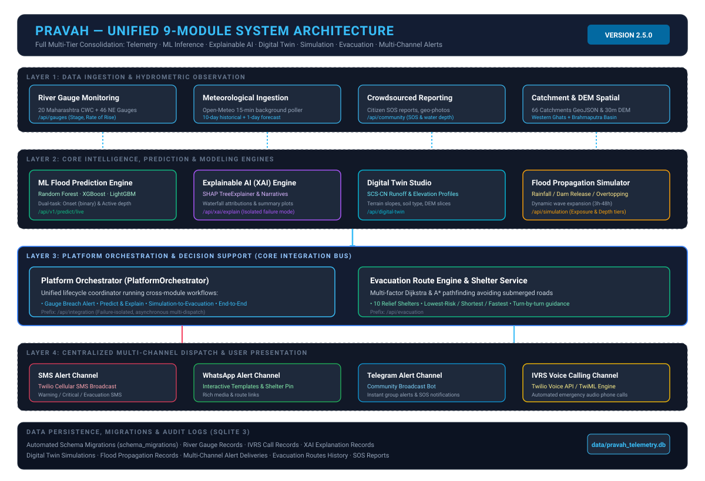

# PRAVAH — Consolidated Platform System Architecture

**Version:** 2.5.0  
**Project:** PRAVAH Flash-Flood Prediction & Early Warning Platform (SIH 2026)  
**Study Regions:** Maharashtra Western Ghats & Northeast India (Brahmaputra Basin)

---

## 1. Executive Summary

PRAVAH is an enterprise-grade, end-to-end hydrological risk intelligence, flood forecasting, and emergency disaster response orchestration platform. It consolidates 9 previously isolated technical subsystems into a single, high-availability, fault-tolerant platform without breaking backward compatibility or altering established machine learning prediction logic.

---

## 2. The Nine Consolidated Subsystems

| # | Subsystem | Module Directory | Primary Responsibilities | Core Technologies |
|---|---|---|---|---|
| **1** | **River Gauge Monitoring** | `src/gauges/` | Real-time hydrometric observation, warning/danger threshold checks, 24-hour rate-of-rise trend tracking. | Pandas, SQLite, CWC Station Catalog |
| **2** | **SMS Alert System** | `src/alerts/channels/sms.py` | Low-latency cellular SMS broadcast to residents and field responders during power or internet outages. | Twilio REST API, E.164 formatting |
| **3** | **WhatsApp Alert System** | `src/alerts/channels/whatsapp.py` | Rich multimedia disaster alerts with interactive CTA buttons, GPS shelter links, and evacuation routes. | Twilio WhatsApp API |
| **4** | **Telegram Alert System** | `src/alerts/channels/telegram.py` | Community-wide broadcast channel alerts and automated SOS incident feeds with HTML formatting. | Telegram Bot API (`sendMessage`) |
| **5** | **IVRS Calling Engine** | `src/alerts/channels/ivrs.py` | Automated emergency outbound voice phone calls synthesizing natural language evacuation directives. | Twilio Voice API, TwiML Text-to-Speech |
| **6** | **Evacuation Route Engine** | `src/evacuation/` | Safe multi-factor pathfinding avoiding submerged road networks to designated elevated relief shelters. | Dijkstra, A* Heuristics, NetworkX |
| **7** | **Explainable AI (XAI)** | `src/xai/` | Transparent feature attribution answering *why* the ML model flagged flood onset or active risk. | SHAP TreeExplainer, Waterfall attributions |
| **8** | **Digital Twin Studio** | `src/digital_twin/` | Virtual watershed sandbox modeling runoff behavior, soil curve numbers, and terrain elevation DEMs. | SCS-CN Hydrology, GeoJSON, 30m SRTM DEM |
| **9** | **Flood Propagation Simulator** | `src/simulation/` | Dynamic flood wave expansion modeling, depth classifications, and population/infrastructure exposure. | Hydraulic D8 Routing, Exposure Mesh |

---

## 3. Multi-Tier Layer Architecture

### Layer 1: Data Ingestion & Observation
- **Automated Weather Poller (`BackgroundScheduler`):** Ingests live precipitation metrics from Open-Meteo every 15 minutes for Western Ghats (Karad) and Northeast (Guwahati/Brahmaputra).
- **Hydrometric River Gauge Catalog:** Ingests live telemetry for 20 CWC Maharashtra gauges and 46 Northeast India stations (`target_metadata.csv` and `station_catalog.csv`).
- **Crowdsourced Community SOS Ingestion:** Ingests citizen incident reports, waterlogged depth tags, and geo-referenced photo evidence (`/api/community`).

### Layer 2: Core Intelligence & Predictive Modeling
- **Machine Learning Inference Engine (`PravahInferenceEngine`):**
  - Dual-task architecture: Task A (Flood Onset Probability) and Task B (Active Inundation Persistence).
  - Models: Tuned Random Forest, Calibrated XGBoost, and LightGBM bundles.
  - Threshold Calibration: Critical Success Index (CSI) optimization ensuring low false-alarm ratios.
- **Explainable AI (XAI) Attribution Engine:**
  - SHAP TreeExplainer generates Shapley attributions for antecedent rainfall (1d, 3d, 7d, 10d) and catchment attributes (slope, area, order).
  - Strict failure isolation: if XAI computation fails, prediction returns safely without interruption.
- **Hydrological Modeling (Digital Twin):**
  - Soil Conservation Service Curve Number (SCS-CN) runoff calculation.
  - Interactive cross-sectional DEM elevation profiles.

### Layer 3: Central Orchestration & Decision Support
- **Platform Orchestrator (`PlatformOrchestrator`):**
  - Manages cross-module pipelines:
    1. Gauge Threshold Breach ➔ Multi-Channel Dispatch
    2. ML Prediction ➔ SHAP Explanation
    3. Simulation ➔ Evacuation Route Generation
    4. End-to-End Early Warning Lifecycle
- **Evacuation Planning Engine (`EvacuationManager`):**
  - Real-time road graph intersection with flood water levels.
  - Dynamic exclusion of flooded culverts, submerged bridges, and low-lying road segments (depth > 0.3m).
  - Optimization modes: Lowest Risk, Shortest Distance, Fastest Travel Time.

### Layer 4: Multi-Channel Alert Delivery
- **Central Dispatcher (`AlertManager`):**
  - Asynchronous parallel dispatch using `asyncio.gather(*tasks, return_exceptions=True)`.
  - Independent channel providers: SMS, WhatsApp, Telegram, and IVRS.
  - Failures in external telecom networks never impede other delivery channels.

### Layer 5: Data Persistence & Migrations
- **SQLite Engine (`data/pravah_telemetry.db`):**
  - Schema migrations tracked in `schema_migrations` table.
  - Additive entity tables: `river_gauge_records`, `ivrs_call_records`, `xai_explanation_records`, `digital_twin_simulation_records`, `flood_propagation_simulation_records`.
  - Complete historical audit log and reversible migration capabilities.

---

## 4. Cross-Cutting Design Principles

1. **Strict Add-Only Architecture:** Zero existing endpoints, schemas, or database tables were modified or renamed.
2. **Failure Isolation:** Any external API failure (Twilio, Telegram, Open-Meteo) or auxiliary calculation failure (SHAP) is caught and handled gracefully. The core inference and alert engine remains 100% operational.
3. **Dual-Region Extensibility:** All modules natively support Maharashtra Western Ghats and Northeast India catchments.
4. **Offline-First Resilience:** In the absence of internet connectivity or live API keys, channels transition smoothly to simulated sandbox modes (`SIM_CALL_...`, `SIM_SMS_...`, `SIM_WA_...`), allowing uninterrupted testing and disaster drills.
