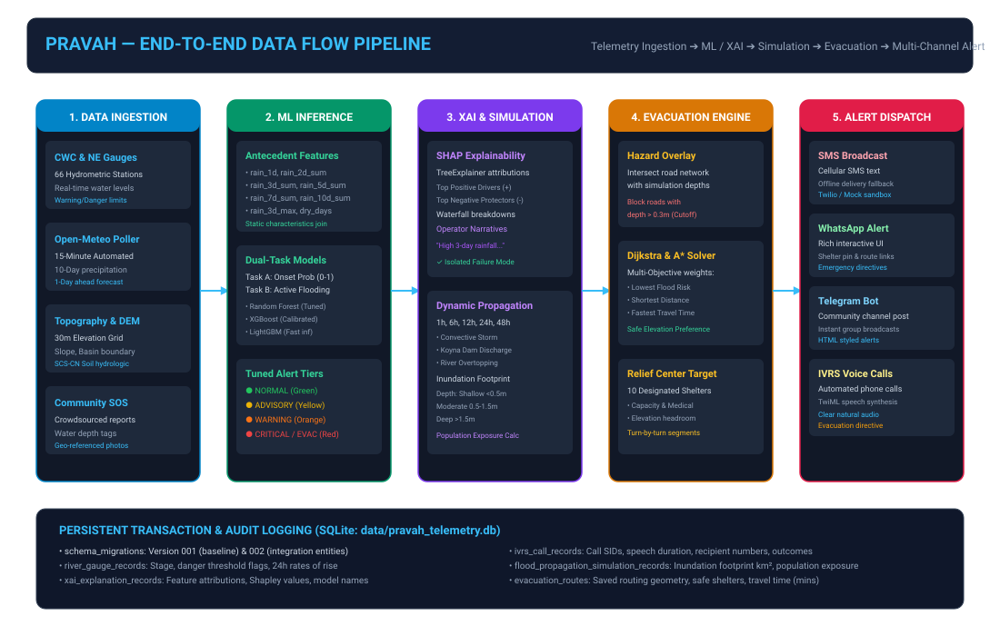

# PRAVAH — Cross-Module Platform Integration Architecture

**Module:** Platform Orchestrator & Integration Bus  
**Package:** `src.integration`  
**Router Prefix:** `/api/integration`

---

## 1. Overview & Architecture Design

The PRAVAH platform connects 9 modular components through a centralized, asynchronous orchestration engine (`PlatformOrchestrator`). The orchestrator acts as a decoupled mediation layer:
- No module holds direct hard-coded circular references to sibling modules.
- Workflows are defined as clean asynchronous pipelines.
- Failure of an auxiliary module (such as SHAP explainability or an external telecom API) never prevents primary inference or emergency response.



---

## 2. Integrated Workflows

### Workflow 1: Hydrometric Gauge Breach ➔ Multi-Channel Alerting
```text
River Stage Observation 
  ➔ Evaluate Warning & Danger Thresholds (GaugeService)
  ➔ Determine Alert Severity (WARNING / CRITICAL / EVACUATION)
  ➔ Build AlertTriggerRequest
  ➔ Asynchronous Dispatch (AlertManager)
      ├─ SMS (Twilio / GSM)
      ├─ WhatsApp (Interactive Card + Shelter Pin)
      ├─ Telegram (Group Channel Broadcast)
      └─ IVRS (Outbound Automated Voice Phone Call)
  ➔ Record in SQLite (river_gauge_records, multi_channel_alerts, ivrs_call_records)
```

### Workflow 2: ML Flood Prediction ➔ Explainable AI (SHAP)
```text
10-Day Precipitation Sequence + Station ID
  ➔ PravahInferenceEngine.predict_live()
      ├─ Task A: Flood Onset Probability
      └─ Task B: Active Inundation State
  ➔ Try: XAIMAnager.explain()
      ├─ SHAP TreeExplainer Feature Attributions
      ├─ Dynamic Headline Narrative Generation
      └─ Save record (xai_explanation_records)
  ➔ Catch Exception:
      ├─ Log warning
      ├─ Set xai_status = "UNAVAILABLE"
      └─ Prediction returns safely intact!
```

### Workflow 3: Flood Propagation Simulation ➔ Safe Evacuation Routing
```text
Scenario Trigger (Convective Rainfall / Dam Release / Overtopping)
  ➔ Flood Propagation Engine runs 6h wave expansion
  ➔ Identify Submerged Road Segments (Depth > 0.3m)
  ➔ Dynamic Road Network Cost Adjustment (Submerged Edge Cost = ∞)
  ➔ Dijkstra / A* Solver determines safest path to elevated shelter
  ➔ Return GeoJSON geometry, distance (km), travel time, and turn-by-turn guidance
```

### Workflow 4: Complete End-to-End Disaster Response Lifecycle
Combines all upstream stages into a single unified pipeline:
1. **Telemetry:** Hydrometric gauge query
2. **AI Predict:** 1-day ahead flood onset probability
3. **XAI:** SHAP feature attribution
4. **Simulation:** Convective flood wave propagation
5. **Evacuation:** Safe pathfinding avoiding submerged segments
6. **Dispatch:** Automated multi-channel notification (SMS + WhatsApp + Telegram + IVRS)

---

## 3. Strict Failure Isolation Matrix

| Subsystem Component | Potential Failure Scenario | Isolated Handling Strategy | Impact on Core System |
|---|---|---|---|
| **Twilio SMS API** | Outage, invalid credentials, or network timeout | Fallback to sandbox mode (`SIM_SMS_...`), log delivery failure, proceed with remaining channels. | **Zero Impact.** WhatsApp, Telegram, and IVRS continue. |
| **Twilio WhatsApp** | Sandbox expired or recipient not opted-in | Caught by `asyncio.gather(..., return_exceptions=True)`, logged as `FAILED_SANDBOX_EXPIRED`. | **Zero Impact.** SMS and Telegram deliver normally. |
| **IVRS Voice Calling** | Outbound carrier busy or call dropped | Saved to `ivrs_call_records` as `DROPPED` or `SIMULATED`, does not block API response. | **Zero Impact.** Other channels finish without delay. |
| **SHAP TreeExplainer** | Memory pressure or feature mismatch | Wrapped in isolated `try/except`. Returns `xai_status="UNAVAILABLE"` with error summary. | **Zero Impact.** ML prediction succeeds and returns `200 OK`. |
| **Digital Twin DEM** | Missing local tile or invalid GeoJSON | Fallback to regional centroid bounding box and default SCS curve number. | **Zero Impact.** Standard simulation fallback. |
| **Open-Meteo Poller** | Network disconnected or rate-limited | Cache retains previous 15-min reading with status marked as `"simulating"`. | **Zero Impact.** Historical replay or cached data used. |
